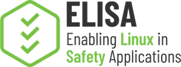

## ELISA Space Grade Linux Special Interests Group

The goal of the group is to advance space technology innovation and competitiveness by developing a common Linux distribution that can be used in space applications, ready for the challenges of deep space, often long lifespan robotic or human-based missions. The nature of space missions brings many challenges, from development to deployment there are multiple considerations that need to be considered. Furthermore this group is the initial step towards creating an ecosystem of supported platforms and a community that benefits from them, and also from the open source nature of the project. (https://lists.elisa.tech/g/space-grade-linux/)

# Minutes

## 25 January 2025

---

# Agenda

- Roll Call
- Brief Notices
- Announcements
- Technical Topics
- Closing

---

# Roll Call

## Attended this meeting

- Ramon Roche (LF)
- Kate Stewart (LF)
- Tim Bird (Sony)
- Andrew E Wilson (L3Harris, BYU, FPGA Zealot)
- Matt Weber (Boeing)
- Dongshik Won (TelePIX, KAIST)
- Tony James (Red Hat)
- Gabriele Paoloni (Red Hat)
- Martin Halle (TUHH)
- Ivan Perez (KBR @ NASA Ames Research Center)
- Michael Mahoney (Wind River)
- Paul Greenwood (Vorago Technologies)
- Chris Heistand (Stoke Space)

## Attended recently in the past

- Ramon Roche (LF)
- Kate Stewart (LF)
- Tim Bird (Sony)
- Andrew E Wilson (L3Harris, BYU, FPGA Zealot)
- Matt Weber (Boeing)
- Dongshik Won (TelePIX, KAIST)
- Tony James (Red Hat)
- Gabriele Paoloni (Red Hat)
- Martin Halle (TUHH)
- Ivan Perez (KBR @ NASA Ames Research Center)
- Michael Mahoney (Wind River)
- Paul Greenwood (Vorago Technologies)

---

# Brief Notices

## Code of Conduct and Legal Notices

- ELISA Project meetings involve participation by industry competitors, and it is the intention of the Linux Foundation to conduct all of its activities in accordance with applicable antitrust and competition laws. It is therefore extremely important that attendees adhere to meeting agendas, and be aware of, and not participate in, any activities that are prohibited under applicable US state, federal, or foreign antitrust and competition laws.
  - [Linux Foundation Antitrust Policy](http://www.linuxfoundation.org/antitrust-policy)
- Email communication will be treated as documentation and be received and made available by the Project under the [Creative Commons Attribution 4.0 International License](http://creativecommons.org/licenses/by/4.0). Please refer to the ELISA Technical Charter section 7 subsection iv. for details.
- The discussions in these meetings are exploratory. The opinions expressed by participants are not necessarily the policy of the companies.
- No recordings of working group meetings are permitted. Special provisions may be arranged for recording in advance with explicit consent of the participants.
- The kernel and LF Code of Conduct applies to all communication with this project
  - [Linux Foundation Code of Conduct](https://www.linuxfoundation.org/code-of-conduct/)
  - Linux [Contributor Covenant Code of Conduct](https://git.kernel.org/pub/scm/linux/kernel/git/torvalds/linux.git/tree/Documentation/process/code-of-conduct.rst)
  - Linux Kernel Contributor Covenant [Code of Conduct Interpretation](https://git.kernel.org/pub/scm/linux/kernel/git/torvalds/linux.git/tree/Documentation/process/code-of-conduct-interpretation.rst)

---

# Announcements

- **Verify your meeting invites only have a https://zoom-lfx.platform.linuxfoundation.org link.  If needed, you can signup at [link](https://zoom-lfx.platform.linuxfoundation.org/meetings/elisa-project?view=week) for the new invite.**

- [Mailing List Sign-up](https://lists.elisa.tech/g/space-grade-linux)

## SGL Workshop

https://github.com/elisa-tech/directory/pull/2

## Upcoming Events

- [FOSDEM 2025, Brussels, Belgium](https://fosdem.org/2025/)

#### Upcoming Deadlines
- SmallSat Abstract (Feb 4th) [link](https://smallsat.org/conference/submit-an-abstract/)
- RISC-V in Space Abstract (Feb 7th) [link](https://www.risc-v.space/wp/#content-1)
- ELC NA 2025 (and safety critical conference) (June 23-25, Denver)
[CFP link](https://events.linuxfoundation.org/open-source-summit-north-america/program/cfp) (CFP deadline Feb 17)
- ELC EU 2025 (and safety critical conference) (Aug 25-27, Amsterdam)

- Space Mission Challenges for Information Technology / Space Computing Conference (Feb 3rd). [link](https://2025.smcit-scc.space/)

---

# Technical Topics

* TSC Update for Virtual Briefing
  * [Draft Vision/Goals](https://elisa.tech/space-grade-linux-sig/)
* DCO Implementation
* License for meta-sgl

## TSC Update for Virtual Briefing

Ramon nominated himself to represent the SIG at the TSC Virtual Briefing

TODO: Write a quick paragraph and make sure calendar aligns.

## Licensing for meta-sgl

https://github.com/elisa-tech/meta-sgl

The group agrees the project should have an explicit license, and its good practice to have the license on every file.

Poky is MIT for meta-data, and GPLv2-only for others.  We plan to do MIT for anything not specified.

We are going to be using Creative Commons for Documentation CC-BY-SA4

**TODO:** Some attendees will review MIT as an option
**TODO:** Tim, will submit a PR for the MIT license.

## DCO / CLA

DCO removes a lot of barriers to entry, and allows individuals to contribute. We think DCO is the way to go, CLA's have a higher barrier for contributions, adds ane extra step that requires legal counsel, and is time consuming.

* How does it work:
  * Developers will need to sign-off commits
  * We need tooling to make sure PRs don't get merged w/o signoffs (There's already a GH App in the marketplace)
* We should follow the [Zephyr](https://docs.zephyrproject.org/latest/contribute/guidelines.html#developer-certification-of-origin-dco)/Kernel repo's for guidance
  * Both projects are using DCO
* Link to DCO [link](https://developercertificate.org)

There was agreement on the call that DCO's are the best option to go forward, and what provides the best development workflow for the community.

**Note:** Maintainers will need to make sure they review any licensing changes in PRs, and make sure license changes are explict and agreed upon.

---

# Closing

## Action Items

Located in [GitHub Issues](https://github.com/elisa-tech/sig-sgl/issues)

## Round Table

### Target Platforms

**Options discussed on the call**
* [BeagleV-Fire](https://www.beagleboard.org/boards/beaglev-fire): [Yocto BSP](https://github.com/polarfire-soc/meta-polarfire-soc-yocto-bsp), MIT license
* AMD-Xilinx FPGA board (MPSoC and/or Versal Edge)
    * MPSoC -> Ultrazed, ZUboard
    * Versal Edge -> Avnet, Trenz, iWave SoM
* Raspberry Pi compute module
* Jetson Family
* Other ISAs
    * x86
    * SPARC - LEON5
    * PowerPC - RAD5500

**Some Requirements:**
* Radiation Performance
* ECC DDR
    * DDR4 ADDR/CMD parity
* Rad-Tolerant bootrom
    * MRAM
* FPGA SOCs
* Quad Core ARM-like
    * Real-time processors like R5s
* 2GB RAM (minimum)
* IO
  * UARTs, I2Cs
  * High-speed, standard networking (for ground development)
